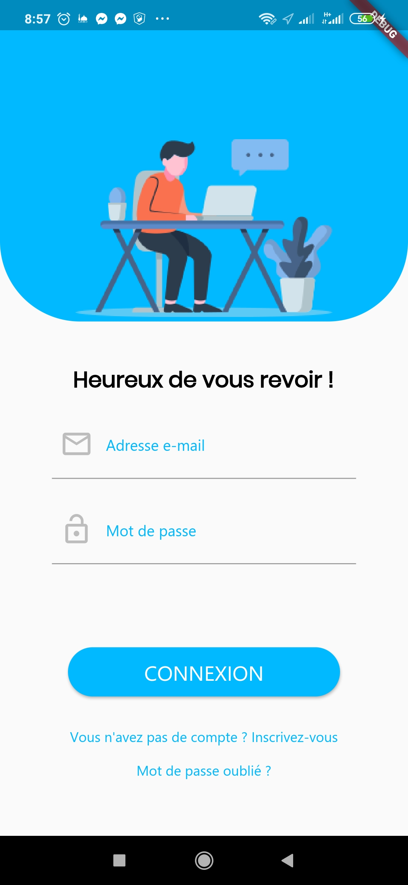

# ClickClinicApp

 

ClickClinic is a mobile app that's main purpose is to offer help to patients to find medical infrastractures i.e doctors, hospitals, pharmacies ... etc, all with simple clicks !
The app also offers the possibility to give or recieve medical support from individual volenteers who want to help by offering several services that the app provide like medicaments' providing, patients' hosting, blood donating and more. Simply by creating an account as "Bénévole".
ClickClinic is destined for Algerian population as the database contains the algerian health infrastractures public data. With ClickClinic we aim to :

1. Minimise the effort and the cost for patients looking for doctors or hospitals near them.
2. Get imidiate help from volunteers in your area (like blood donators in urgent cases ...).
3. Be able to offer help for people in need.

# Technologies

# System architecture

## File structure

# UI

| Splash Screen | Onboarding-1 | Onboarding-2 | Onboarding-3 |
|:-:|:-:|:-:|:-:|
|  |  |  |  |

| Welcome Menu | Patient Menu-1 | Patient Menu-2 | Patient Menu-3 |
|:-:|:-:|:-:|:-:|
|  |  |  |  |

| Doctors | Hospitals | Pharmacies | Blood Donators |
|:-:|:-:|:-:|:-:|
|  |  |  |  |

| Laboratories | Parapharmacies | Opticiens | Imagerie Centers |
|:-:|:-:|:-:|:-:|
|  |  |  |  |

| Doctor Details | Etablissement Details | Benevole List | Benevole Details |
|:-:|:-:|:-:|:-:|
|  |  |  |  |

| Register | Setting Services | Setting BloodType | Setting Location |
|:-:|:-:|:-:|:-:|
|  |  |  |  |

| Sign In | Reset Password | Home | Menu |
|:-:|:-:|:-:|:-:|
|  |  |  |  |

| App Setting | Account Setting | Service Setting-1 | Service-Setting-2 |
|:-:|:-:|:-:|:-:|
|  |  |  |  |

# Demo

## Team
